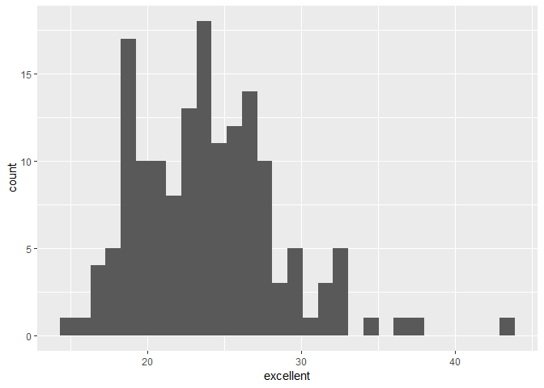

p8105\_hw2\_lz2657
================
Lingyu Zhang
Sep 30, 2018

Problem 1
---------

First, read and clean the data as required.

``` r
NYC_subway_data = read_csv(file = "./data/NYC_Transit_Subway_Entrance_And_Exit_Data.csv") %>%
  janitor::clean_names() %>%
  select(line:entry, vending, ada) %>%
  mutate(entry=as.logical(ifelse(entry == 'YES', TRUE, FALSE)))
```

    ## Parsed with column specification:
    ## cols(
    ##   .default = col_character(),
    ##   `Station Latitude` = col_double(),
    ##   `Station Longitude` = col_double(),
    ##   Route8 = col_integer(),
    ##   Route9 = col_integer(),
    ##   Route10 = col_integer(),
    ##   Route11 = col_integer(),
    ##   ADA = col_logical(),
    ##   `Free Crossover` = col_logical(),
    ##   `Entrance Latitude` = col_double(),
    ##   `Entrance Longitude` = col_double()
    ## )

    ## See spec(...) for full column specifications.

The dataset now contains variables of line, station name, station latitude / longitude, routes served, entry, vending, entrance type, and ADA compliance. I read the original dataset, cleaned the names, selected the variables I need and convert the entry variable to logical by 'mutate' and 'ifelse' function.

The dimension of the dataset is 1868 x 19. The data is not tidy yet.

There are 465 distinct stations.

468 stations are ADA compliant.

37.7% of station entrances / exits without vending allow entrance.

Then reformat the dataset.

``` r
NYC_subway_data = mutate(NYC_subway_data, route_number = rowSums(!is.na(select(NYC_subway_data, route1:route11)))) %>%
  unite(route_name, route1:route11, sep='/', remove = TRUE) %>%
  select(line:station_longitude, route_number, route_name, everything())

NYC_subway_data$route_name = gsub("/NA","",NYC_subway_data$route_name)

NYC_subway_data
```

    ## # A tibble: 1,868 x 10
    ##    line  station_name station_latitude station_longitu~ route_number
    ##    <chr> <chr>                   <dbl>            <dbl>        <dbl>
    ##  1 4 Av~ 25th St                  40.7            -74.0            1
    ##  2 4 Av~ 25th St                  40.7            -74.0            1
    ##  3 4 Av~ 36th St                  40.7            -74.0            2
    ##  4 4 Av~ 36th St                  40.7            -74.0            2
    ##  5 4 Av~ 36th St                  40.7            -74.0            2
    ##  6 4 Av~ 45th St                  40.6            -74.0            1
    ##  7 4 Av~ 45th St                  40.6            -74.0            1
    ##  8 4 Av~ 45th St                  40.6            -74.0            1
    ##  9 4 Av~ 45th St                  40.6            -74.0            1
    ## 10 4 Av~ 53rd St                  40.6            -74.0            1
    ## # ... with 1,858 more rows, and 5 more variables: route_name <chr>,
    ## #   entrance_type <chr>, entry <lgl>, vending <chr>, ada <lgl>

There are 273 distinct stations serve the A train.

Of the stations that serve the A train, 107 are ADA compliant.

Problem 2
---------

First, read and clean the Mr. Trash Wheel sheet as required.

``` r
trash_wheel_data = read_excel("./data/HealthyHarborWaterWheelTotals2018-7-28.xlsx", range = cell_cols("A:N")) %>%
  janitor::clean_names() %>%
  filter(!is.na(dumpster)) %>%
  mutate(sports_balls=as.integer(round(sports_balls)))

trash_wheel_data
```

    ## # A tibble: 285 x 14
    ##    dumpster month  year date                weight_tons volume_cubic_ya~
    ##       <dbl> <chr> <dbl> <dttm>                    <dbl>            <dbl>
    ##  1        1 May    2014 2014-05-16 00:00:00        4.31               18
    ##  2        2 May    2014 2014-05-16 00:00:00        2.74               13
    ##  3        3 May    2014 2014-05-16 00:00:00        3.45               15
    ##  4        4 May    2014 2014-05-17 00:00:00        3.1                15
    ##  5        5 May    2014 2014-05-17 00:00:00        4.06               18
    ##  6        6 May    2014 2014-05-20 00:00:00        2.71               13
    ##  7        7 May    2014 2014-05-21 00:00:00        1.91                8
    ##  8        8 May    2014 2014-05-28 00:00:00        3.7                16
    ##  9        9 June   2014 2014-06-05 00:00:00        2.52               14
    ## 10       10 June   2014 2014-06-11 00:00:00        3.76               18
    ## # ... with 275 more rows, and 8 more variables: plastic_bottles <dbl>,
    ## #   polystyrene <dbl>, cigarette_butts <dbl>, glass_bottles <dbl>,
    ## #   grocery_bags <dbl>, chip_bags <dbl>, sports_balls <int>,
    ## #   homes_powered <dbl>

Then read and clean precipitation data for 2016 and 2017.

``` r
precipitation_2016_data = read_excel("./data/HealthyHarborWaterWheelTotals2018-7-28.xlsx", sheet = "2016 Precipitation", range = "A2:B14") %>%
  janitor::clean_names() %>%
  filter(!is.na(total)) %>%
  mutate(year = 2016) %>%
  select(year, month, total)

precipitation_2016_data
```

    ## # A tibble: 12 x 3
    ##     year month total
    ##    <dbl> <dbl> <dbl>
    ##  1  2016     1  3.23
    ##  2  2016     2  5.32
    ##  3  2016     3  2.24
    ##  4  2016     4  1.78
    ##  5  2016     5  5.19
    ##  6  2016     6  3.2 
    ##  7  2016     7  6.09
    ##  8  2016     8  3.96
    ##  9  2016     9  4.53
    ## 10  2016    10  0.62
    ## 11  2016    11  1.47
    ## 12  2016    12  2.32

``` r
precipitation_2017_data = read_excel("./data/HealthyHarborWaterWheelTotals2018-7-28.xlsx", sheet = "2017 Precipitation", range = "A2:B14") %>%
  janitor::clean_names() %>%
  filter(!is.na(total)) %>%
  mutate(year = 2017) %>%
  select(year, month, total)

precipitation_2017_data
```

    ## # A tibble: 12 x 3
    ##     year month total
    ##    <dbl> <dbl> <dbl>
    ##  1  2017     1  2.34
    ##  2  2017     2  1.46
    ##  3  2017     3  3.57
    ##  4  2017     4  3.99
    ##  5  2017     5  5.64
    ##  6  2017     6  1.4 
    ##  7  2017     7  7.09
    ##  8  2017     8  4.44
    ##  9  2017     9  1.95
    ## 10  2017    10  0   
    ## 11  2017    11  0.11
    ## 12  2017    12  0.94

Now combine datasets and convert month to a character variable.

``` r
precipitation_data = full_join(precipitation_2016_data, precipitation_2017_data, by = NULL) %>%
  mutate(month = month.name[month])
```

    ## Joining, by = c("year", "month", "total")

``` r
precipitation_data
```

    ## # A tibble: 24 x 3
    ##     year month     total
    ##    <dbl> <chr>     <dbl>
    ##  1  2016 January    3.23
    ##  2  2016 February   5.32
    ##  3  2016 March      2.24
    ##  4  2016 April      1.78
    ##  5  2016 May        5.19
    ##  6  2016 June       3.2 
    ##  7  2016 July       6.09
    ##  8  2016 August     3.96
    ##  9  2016 September  4.53
    ## 10  2016 October    0.62
    ## # ... with 14 more rows

The Mr. Trash Wheel dataset includes 14 variables, including dumpster, date, weight, volume, sports\_balls and so on. The number of observations is 285. The precipitation dataset includes three variables: year, month and total. It shows the precipitation data for each month in 2016 and 2017. The number of precipitations is 24. The total precipitation in 2017 is 32.93. The median number of sports balls in a dumpster in 2016 is 26.

Problem 3
---------

First, read and manipulate the data as required.

``` r
data("brfss_smart2010")
brfss_data = brfss_smart2010 %>%
  janitor::clean_names() %>%
  filter(topic == "Overall Health") %>%
  select(-class, -topic, -question, -sample_size, -(confidence_limit_low:geo_location)) %>%
  spread(key = response, value = data_value) %>%
  janitor::clean_names() %>%
  select(year, locationabbr, locationdesc, excellent, very_good, good, fair, poor) %>%
  mutate(proportion = excellent + very_good)

brfss_data
```

    ## # A tibble: 2,125 x 9
    ##     year locationabbr locationdesc excellent very_good  good  fair  poor
    ##    <int> <chr>        <chr>            <dbl>     <dbl> <dbl> <dbl> <dbl>
    ##  1  2002 AK           AK - Anchor~      27.9      33.7  23.8   8.6   5.9
    ##  2  2002 AL           AL - Jeffer~      18.5      30.9  32.7  12.1   5.9
    ##  3  2002 AR           AR - Pulask~      24.1      29.3  29.9  12.5   4.2
    ##  4  2002 AZ           AZ - Marico~      21.6      36.6  26.9  10.3   4.6
    ##  5  2002 AZ           AZ - Pima C~      26.6      30.1  31.9   7.5   3.9
    ##  6  2002 CA           CA - Los An~      22.7      29.8  28.7  14.3   4.5
    ##  7  2002 CO           CO - Adams ~      21.2      31.2  29    14.4   4.2
    ##  8  2002 CO           CO - Arapah~      25.5      35.2  29.3   8     2.1
    ##  9  2002 CO           CO - Denver~      22.2      27.1  36.6  11.1   3  
    ## 10  2002 CO           CO - Jeffer~      23.4      36.6  26.3  11.4   2.4
    ## # ... with 2,115 more rows, and 1 more variable: proportion <dbl>

404 unique locations are included in the dataset. Every state is represented since there are 51 different location abbreviations. NJ is observed the most.

In 2002, the median of the “Excellent” response value is 23.6.

Now make a histogram of “Excellent” response values in the year 2002

``` r
ggplot(subset(brfss_data, year == 2002), aes(x = excellent)) + 
  geom_histogram()
```

    ## `stat_bin()` using `bins = 30`. Pick better value with `binwidth`.

    ## Warning: Removed 2 rows containing non-finite values (stat_bin).



Then make a scatterplot showing the proportion of “Excellent” response values in New York County and Queens County in each year from 2002 to 2010.

``` r
ggplot(subset(brfss_data, locationdesc == "NY - New York County" | locationdesc == "NY - Queens County"), aes(x = year, y = excellent)) + 
  geom_point(aes(color = locationdesc))
```


